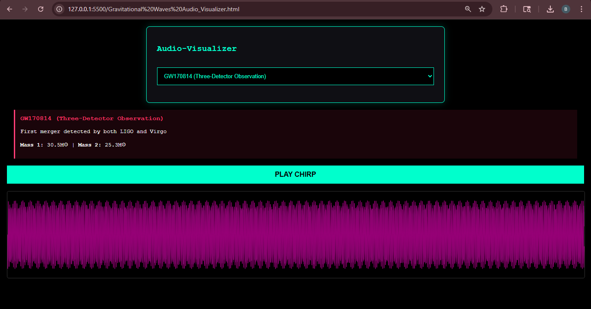
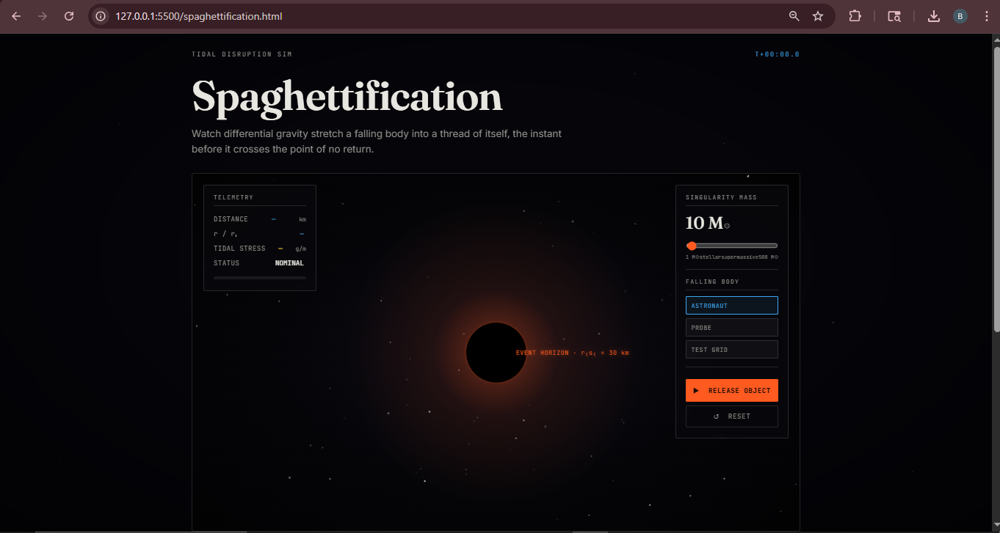

# Physics-Around-Black-holes-
Black holes are among the most fascinating objects studied in Physics, especially in areas like Astrophysics and General Relativity.Black holes are predicted by Theory of Relativity, developed by Albert Einstein. According to this theory, massive objects bend space and time. A black hole bends it so much that it creates a “trap” in spacetime.

Overview:
This project visulaizes the physics around the black holes in two connected modules:
1. Audio Visualizer: maps live or uploaded audio  onto accretion disk and event horizon, so the simulation pulses and wraps with sound.
2. Spaghettification Simulator: animates an probe/astronaut falling past the event horizon, stretching it radially andcompressing it laterally to demonstrate tidal force gradients.

Features:
1. Audio-reactive accretion Disk
2. Spaghettifiaction simulation with adjustable mass of blackhole

Preview:

Tech Stack:
Javscript
HTML
CSS

Installation:
https://github.com/bhaskarvar47-web/Physics-Around-Black-holes-/commits/main/

Physics Background:

1. Gravitational Lensing: Light passing near a black hole bends due to space time curvature, distorting the appearence of the accretion disk and background stars.
2. Event Horizon: The boundary beyond which nothing, not even light can escape.
3. Spaghettification:  As an object approaches a black hole, the gravitational pull on the near side becomes dramatically stronger than on the far side, stretching the object into a thin, elongated shape — most extreme near stellar-mass black holes with steep tidal gradients.

Acknowledgments: 
1. Inspired by real astrophysical simulators of black hole imaging.
2. There is somewhat use of ai in it - in making the website more beautiful and some extra complex code for simulator.